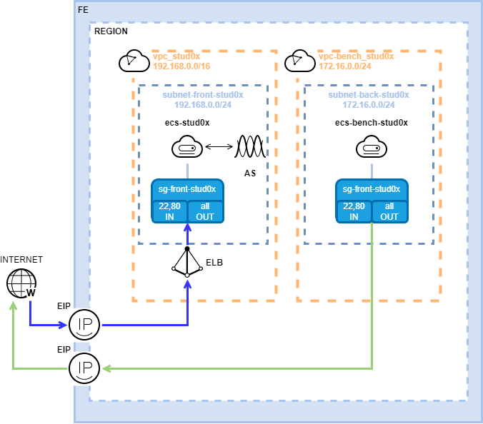

# LAB: Deployment of an apache and AS/ELB configuration

## Description

Deploying a apache server with a Auto Scalling (AS) and Elastic Load Balance (ELB). 


Requested FE Services:
* 1 KeyPair
* 2 EIP
* 2 ECS
* 1 IMS
* 1 ELB
* 1 AS
* 2 VPC
* 2 Subnets
* 2 SG

## Targeted architecture 


## Procedure

Follow these steps:
1. Key-pairs creation
2. Network creation
3. Security groups creation
5. Elastic Cloud Server (ECS) creation
6. Private Image (IMS) creation
7. Elastic Load Balance (ELB) creation
8. Auo Scalling (AS) creation 
9. Stress test
10. Resources deletion

## Key-pairs creation

Basic Informations:
* Name: **kp_stud0x**
* Download the private key file

## Network creation: Virtual Private Cloud (VPC) and Subnet creation 

Basic Informations:
* Region: **Student Project**
* Name: **vpc_stud0x**
* CIDR Block: **192.168.0.0/16**
* Tag: key=**owner**;value=**stud0x**
* Default Subnet: 
  * AZ: **eu-west-0a**
  * Name: **subnet-front-stud0x**
  * CIDR Block: **192.168.0.0/24** 

## Security groups creation

Basic Informations:
* Name: **sg_front_stud0x**
  * Add  2 Inbound rules (Port **80**/source **"0.0.0.0/0"**; Port **22**/source **"0.0.0.0/0"**)
  
## Elastic Cloud Server (ECS) creation

ECS creation preparation:
Downloading apache2.sh file, from the desktop where you access the FE protal
https://obs-formation-imt.oss.eu-west-0.prod-cloud-ocb.orange-business.com/obs-imt-lab2/Apache2.sh

Basic Informations:
* Region: **Student Project**
* AZ: **eu-west-0a**
* Flavor: **s3.small.1**
* Image: **Public image**
  * **OBS Ubuntu 16.04(40GB)**
* Disk: **Common I/O 40GB**
* VPC: **vpc_stud0x**
* Primary NIC: **subnet-front-stud0x**
* Security Goup: **sg_front_stud0x**
* EIP: **Automatically assign**
* Bandwith: **100 Mbit/s**
* Key pair: **kp_stud0x**
* Advanced Settings: **Configure now**
* User Data injection: **As file**
  * Select File: **Apache2.sh**
* Tag: key=**owner**;value=**stud0x** 
* ECS Name: **ecs_stud0x**

Apache installation verification:

http://\<EIP\>

## Private Image (IMS) creation

1. First off all, stop the stud0x ECS
2. Detach the EIP from the stud0x ECS
3. Private Image creation:
  * Basic Informations
    * Type: **System disk image** 
    * Source: **ECS**
    * ECS: **ecs_stud0x**
    * Name: **img-ecs-stud0x** 
      * Tag: key=**owner**;value=**stud0x** 

## Elastic Load Balance (ELB) creation 

Basic Informations:
* **Create Elastic Load Balancer** 
* Region:  **Student Project**
* Name: **elb_stud0x**
* Network Type: **Public network**
* VPC: **vpc_stud0x**
* EIP: **Use existing** (select the EIP)
* **Create Now**
* Select the Elastic ELB **elb_stud0x**
  * **Add Listeners**
  * Name: **listener_stud0x_web**
  * Frontend Protocol/Port: **HTTP/80**
  * Backend Protocol/Port: **HTTP/80**
  * Load Balancing Algorithm: **Weighted round robin**
  * Sticky Session: **no**
  * Health Check Protocol/Port: **HTTP/80**
  * Interval (s): **5**
  * Timeout (s): **10**
  * Healthy Threshold: **3**
  * Unhealthy Threshold: **3**
  * Check Path: **/**
* Select the Classic ELB **elb_stud0x**
  * **Add Listeners**
  * Name: **listener_stud0x_ssh**
  * Frontend Protocol/Port: **TCP/22**
  * Backend Protocol/Port: **TCP/22**
  * Load Balancing Algorithm: **Weighted round robin**
  * Sticky Session: **yes**
  * Stickiness Duration (min): **5** 
  * Health Check Protocol/Port: **TCP/22**
  * Interval (s): **5**
  * Timeout (s): **10**
  * Healthy Threshold: **3**
  * Unhealthy Threshold: **3**

## Auto Scalling (AS) creation

Basic Informations:
* Create AS Groups 
  * Region: **Student Project**
  * Name: **as-group-stud0x**
  * Max. Instances: **3**
  * Expected Instances: **1**
  * Min. Instances: **1**
  * AZ: **eu-west-0a and eu-west-0b**
  * VPC: **vpc_stud0x**
  * Subnet: **subnet-front-stud0x**
  * Load Balancing: **Enhanced load balancer**
    * Load Balancer: **elb_stud0x**
    * Listener: **listener_stud0x_ssh**
  * Load Balancing: **Classic load balancer**
    * Load Balancer: **elb_stud0x**
    * Listener: **listener_stud0x_web**
  * Health Check Method: **ELB health check**
  * Health Check Interval: **5 minutes**
  * Instance Removal Policy: **Oldest Instance created from on the oldest AS configuration**
  * Release EIP on Instance Removal: **Yes**
* ADD AS Configuration 
  * Name: **as-config-stud0x**
  * Configuration Template: **Create a new specification template**
  * ECS Type: **s3.small.1**
  * **Private Image**
  * Image: **img-ecs-stud0x(40 GB)**
  * Disk: **Common I/O 40GB**
  * Security Goup: **sg_front_stud0x**
  * EIP: **Do not use**
  * Key Pair: **kp_stud0x**
  * Advanced Settings: **Configure now**
    * **As text**
```
#!/bin/bash
sudo sed -i -e "s/It works/$HOSTNAME \: It works/" /var/www/html/index.html 
```
* Add AS Policy 
  * Policy Name: **as-policy-cpu-usage**
  * Policy Type: **Alarm**
  * Alarm Rule: **Create**
  * Rule Name: **as-alarm-sup05**
  * Trigger Condition: **CPU Usage Avg. >= 5%**
  * Monitoring Interval: **5 minutes**
  * Consecutive Occurences: **1**
  * Scaling Action: **Add 1 instances**
  * Cooldown Period(s): **300**

Verification:
http://\<ELB EIP\>

## Stress test

### ECS creation preparation:
Downloading *Bench.sh file*, from the desktop where you access the FE protal:
https://obs-formation-imt.oss.eu-west-0.prod-cloud-ocb.orange-business.com/obs-imt-lab2/Bench.sh

### Stress environnement deployment:

#### Virtual Private Cloud (VPC) and Subnet creation

Basic Informations:
* Region:  **Student Project**
* Name:  **vpc_bench_stud0x**
* Name: CIDR Block: **172.16.0.0/24**
* Tag key: **owner**; Tag value: **stud0x**
* Default Subnet:
  * AZ: **eu-west-0a**
  * Name: **subnet-bench-stud0x**
  * CIDR Block: **172.16.0.0/24**

#### ECS creation

Basic Informations:
* Region: **Student Project**
* AZ: **eu-west-0a**
* Flavor: **s3.xlarge.4**
* Image: **Public image**
  * **OBS Ubuntu 18.04(40GB)**
* VPC: **vpc_bench_stud0x**
* Primary NIC: **subnet-bench-stud0x**
* Security Goup: **sg_front_stud0x**
* EIP: **Automatically assign**
* Bandwith: **1000 Mbit/s**
* Key pair: **kp_stud0x**
* Advanced Settings: **Configure now**
* User Data injection: **As file**
  * Select File: **benchVM.sh**
* Tag key: **owner**; Tag value: **stud0x**
* ECS Name: **ecs_bench_stud0x**

#### Connect to ECS

1. Accessing the created ECS  ecs_bench_stud0x (with ECS EIP) and Apache server (with ELB EIP): [Logging in to an ECS](https://docs.prod-cloud-ocb.orange-business.com/en-us/usermanual/ecs/en-us_topic_0092494193.html)

2. From Apache server session launch this command:
```
top
```
3. From ECS  ecs_bench_stud0x session launch this command after replacing \<ELB EIP\> with the right EIP: 
```
while (true); do ab -k -n 100000000 -c 1010 http://<ELB EIP>/index.html; done
```
4. Notice the cpu consumption increase on Apache server and also the CPU Usage of AS GROUPs *as-group-stud0x* (AS GROUPS + as-group-stud0x + Monitoring) .

5. After few minutes, notice the increase of Number of instances (AS GROUPS + as-group-stud0x + Monitoring).

6. stop the **ecs_bench_stud0x**

7. In a HTTP navigator reload several time the page http://\<ELB EIP\>, and notice the change of ECS in the top of the page

## Resources deletion

Control the resources created:
* go to *"My Resources"*

Resources deletion:
1. Auto Scaling (AS)
  * Modify the AS Group configuration
    * Expected Instances: 0 
    * Min. Instances: 0
2. Image Management Service (IMG)
3. Elastic Cloud Server (ECS)
4. Auto Scaling
  * AS Groups
  * AS Configuration
5. Elastic Load Balance (ELB)
6. Security Groups (SG)
7. Subnets
8. Virtual Private Cloud (VPC)

