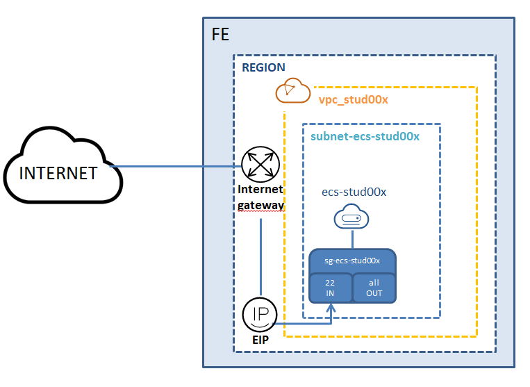
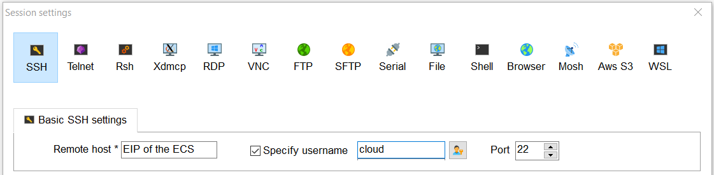
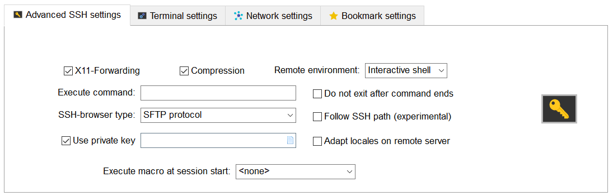
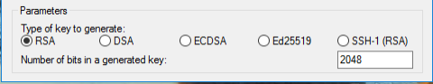
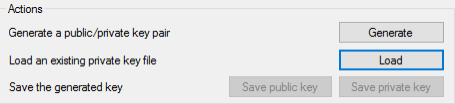
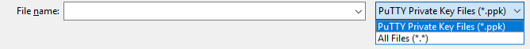
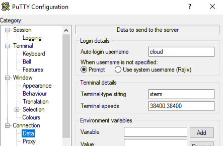
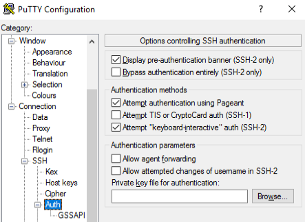
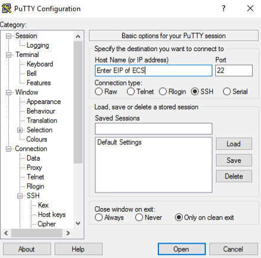

# LAB: Deploying a Linux ECS

## Description

Deploying a Linux - Debian and accessing it via ssh on its Public IP.

Requested FE Services:
* 1 KeyPair
* 1 EIP
* 1 ECS
* 1 VPC
* 1 Subnet
* 1 SG

## Targeted architecture 

## Procedure

Follow these steps:
1. Key-pair creation
2. Network creation
3. Security groups creation
4. Elastic Cloud Server (ECS) creation
5. Connect to ECS via ssh
6. Resources deletion
 

## Key-pair creation

Basic Informations:
* Name: **kp_stud0x**
* Download the private key file

## Network creation: Virtual Private Cloud (VPC) and Subnet creation 

Basic Informations:
* Region: **Student Project**
* Name: **vpc_stud0x**
* CIDR Block: **192.168.0.0/16**
* Tag: key=**owner** ;value=**stud0x**
* Default Subnet: 
  * AZ: **eu-west-0a**
  * Name: **subnet-ecs-stud0x**
  * CIDR Block: **192.168.0.0/24**
  * Tag: key=**owner** ;value=**stud0x**  

## Security groups creation

Basic Informations:
* Name: **sg_ecs_stud0x**
  * Add  1 Inbound rule (Port **22**/source **"0.0.0.0/0"**)

  
## Elastic Cloud Server (ECS) creation

Basic Informations:
* Region: **Student Project**
* AZ: **eu-west-0a**
* Flavor: **s3.large.2**
* Image: **Public image**
  * **OBS Debian 9.0(40GB)**
* Disk: **Common I/O 100GB**
* VPC: **vpc_stud0x**
* Primary NIC: **subnet-ecs-stud0x**
* Security Goup: **sg_ecs_stud0x**
* EIP: **Automatically assign**
* Bandwith: **100 Mbit/s**
* Key pair: **kp_stud0x**
* Advanced Settings: **Do not Configure**
* ECS Name: **ecs_stud0x**
* Tag: key=**owner** ;value=**stud0x**

## Connect to ECS via ssh

Accessing the created ECS (use the EIP, keypair and the 'cloud' user): 

**Method 1:** Use MobaXterm to log in to the ECS.

MobaXterm can be downloaded [here](https://mobaxterm.mobatek.net/download.html)

* Create a new SSH session by specifying the EIP of the ECS, set the username as "cloud" and the port as 22.

* In "Advanced SSH settings" tick "use private key" and select the key-pair associated with the ECS. 

* Click "OK" to save the connection.  Run the session from the "User sessions" list to connect to the ECS.

**Method 2:** Use PUTTY to log in to the ECS.

PuTTY and PuTTYgen can be downloaded [here](https://www.chiark.greenend.org.uk/~sgtatham/putty/latest.html)

**Convert your private key using PuTTYgen**

    PuTTY does not natively support the private key format for SSH keys.
    PuTTY provides a tool named PuTTYgen, which converts keys to the required format for PuTTY.
    You must convert your key-pair (.pem file) into this format (.ppk file) as follows in order to connect to your ECS using PuTTY. 

* Run PuTTYgen. 

* Under Type of key to generate, choose RSA. If you're using an older version of PuTTYgen, choose SSH-2 RSA. 
 

* Choose Load. 

* By default, PuTTYgen displays only files with the extension .ppk. To locate your .pem file, choose the option to display files of all types.
 

* Select your .pem file for the key pair that you specified when you created the ECS and choose Open. 

* PuTTYgen displays a notice that the .pem file was successfully imported.

* Choose OK.

* To save the key in the format that PuTTY can use, choose Save private key.

* PuTTYgen displays a warning about saving the key without a passphrase. 

* Choose Yes. 

* Specify the same name for the key that you used for the key pair (for example, my-key-pair) and choose Save.

* PuTTY automatically adds the .ppk file extension.

* Your private key is now in the correct format for use with PuTTY. You can now connect to your instance using PuTTY's SSH client. 

**Connect to the ECS via PuTTY**

* Run PuTTY

* Choose Connection > Data. Enter the username "cloud" in Auto-login username.

* Choose Connection > SSH > Auth. In the last configuration item Private key file for authentication, click Browse and select the private key (.ppk) converted earlier.

* Choose Session and enter the EIP of the ECS under Host Name, set port to 22.  Click Open to log in to the ECS.

* For more information consult the following documentation:[Logging in to an ECS](https://docs.prod-cloud-ocb.orange-business.com/en-us/usermanual/ecs/en-us_topic_0092494193.html)

## Resources deletion
Control the resources created:
* go to *"My Resources"*

Resources deletion:
1. Elastic Cloud Server (ECS)
2. Security Groups (SG)
3. Key-pair
4. Subnet
5. Virtual Private Cloud (VPC)

## END  OF  LAB

