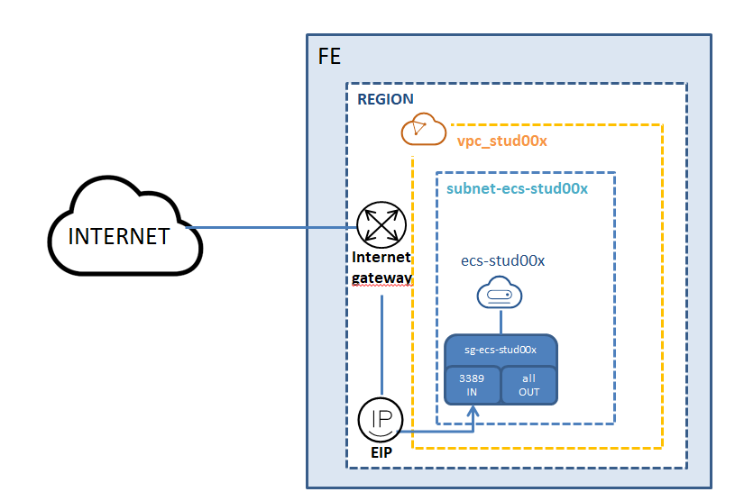
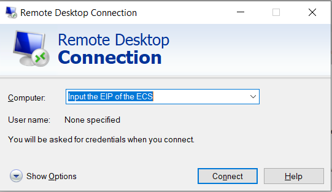

# LAB: Deploying a Windows ECS

## Description

Deploying a Windows Server and accessing it via RDP on its Public IP.

Requested FE Services:
* 1 KeyPair
* 1 EIP
* 1 ECS
* 1 VPC
* 1 Subnet
* 1 SG

## Targeted architecture 

## Procedure

Follow these steps:
1. Key-pair creation
2. Network creation
3. Security groups creation
4. Elastic Cloud Server (ECS) creation
5. Connect to ECS via RDP
6. Resources deletion
 

## Key-pair creation

Basic Informations:
* Name: **kp_stud0x**
* Download the private key file

## Network creation: Virtual Private Cloud (VPC) and Subnet creation 

Basic Informations:
* Region: **Student Project**
* Name: **vpc_stud0x**
* CIDR Block: **192.168.0.0/16**
* Tag: key=**owner** ;value=**stud0x**
* Default Subnet: 
  * AZ: **eu-west-0a**
  * Name: **subnet-ecs-stud0x**
  * CIDR Block: **192.168.0.0/24**
  * Tag: key=**owner** ;value=**stud0x**  

## Security groups creation

Basic Informations:
* Name: **sg_ecs_stud0x**
  * Add  1 Inbound rule (Port **3389**/source **"0.0.0.0/0"**)

  
## Elastic Cloud Server (ECS) creation

Basic Informations:
* Region: **Student Project**
* AZ: **eu-west-0a**
* Flavor: **s3.xlarge.2**
* Image: **Public image**
  * **OBS Windows Server 2019 Standard(67GB)**
* Disk: **Common I/O 100GB**
* VPC: **vpc_stud0x**
* Primary NIC: **subnet-ecs-stud0x**
* Security Goup: **sg_ecs_stud0x**
* EIP: **Automatically assign**
* Bandwith: **100 Mbit/s**
* Key pair: **kp_stud0x**
* Advanced Settings: **Do not Configure**
* ECS Name: **ecs_stud0x**
* Tag: key=**owner** ;value=**stud0x**

## Connect to ECS via RDP

Obtaining Administrator password and connecting to the ECS: 

* On FE console obtain the Administrator password of the ECS. 

* On your workstation, run MSTSC and input the EIP (public ip) of the ECS.

* Connect using the Administrator account and password.

For more information consult the following documentation: [Logging in to an ECS](https://docs.prod-cloud-ocb.orange-business.com/en-us/usermanual/ecs/en-us_topic_0092494193.html)

## Resources deletion
Control the resources created:
* go to *"My Resources"*

Resources deletion:
1. Elastic Cloud Server (ECS)
2. Security Groups (SG)
3. Key-pair
4. Subnet
5. Virtual Private Cloud (VPC)

## END  OF  LAB
